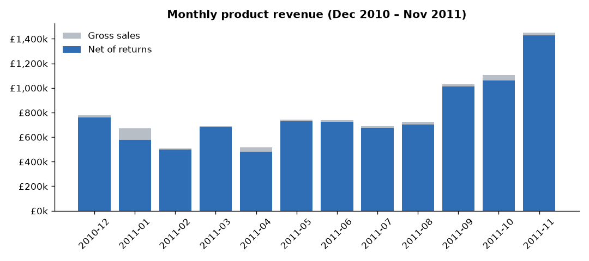
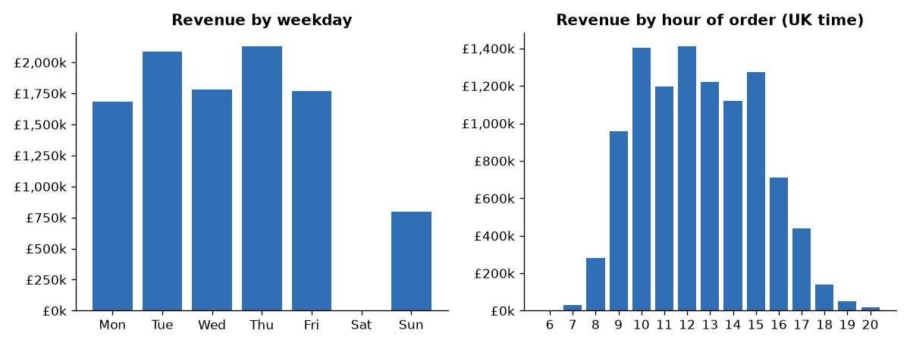
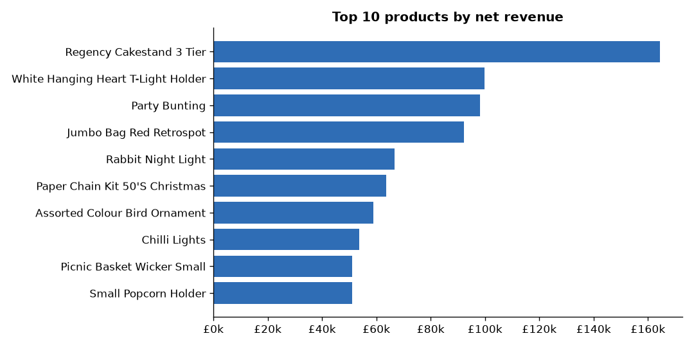
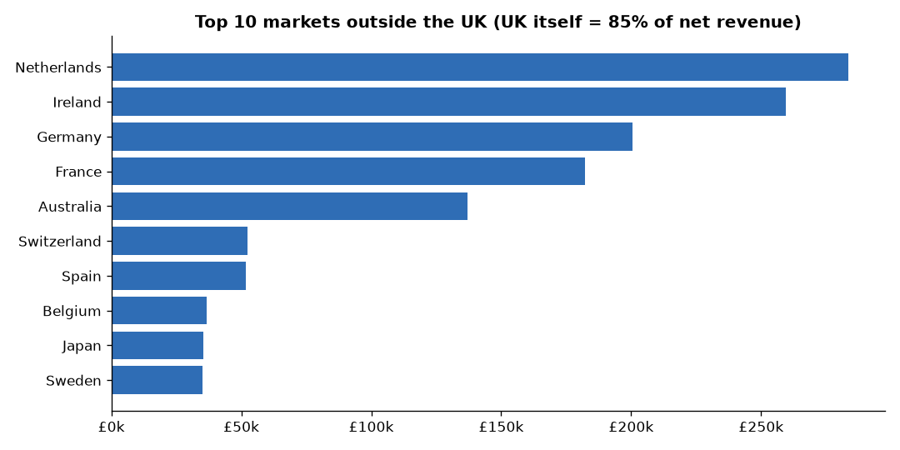

# Retail Data Cleaning & EDA

Turning **541,909 messy real-world transactions** from a UK online gift retailer into a clean, trustworthy sales table, then exploring it for business insights.

> **Status: in progress.** Cleaning pipeline and EDA are done (below). The customer view (repeat rate, Pareto) and final recommendations come next.

## Business problem
The raw export is what a real business hands an analyst: a quarter of rows with no customer, duplicates, cancellations mixed in with sales, and postage and bank fees recorded as "products". Report revenue straight from it and every KPI is wrong. The goal is to make each cleaning decision **explicit, measured and repeatable**, so finance and marketing can trust the numbers built on it.

## Data
[UCI Online Retail](https://archive.ics.uci.edu/dataset/352/online+retail) (Chen, 2015, CC BY 4.0). Every transaction of a UK-based, non-store online retailer between 2010-12-01 and 2011-12-09. Many of its customers are wholesalers. It's a 23.7 MB Excel file, downloaded by script rather than committed.

## What the audit found (raw file)
| Issue | Rows | Share |
|---|---:|---:|
| Missing CustomerID (guest checkout) | 135,080 | 24.93% |
| Exact duplicate rows | 5,268 | 0.97% |
| Cancellation lines (`C…` invoices) | 9,288 | 1.71% |
| Non-product codes (postage, fees, manual, samples) | 2,995 | 0.55% |
| Quantity ≤ 0 | 10,624 | 1.96% |
| UnitPrice ≤ 0 | 2,517 | 0.46% |
| Missing Description | 1,454 | 0.27% |

## Cleaning rules (applied in order, each one logged)
1. Trim text, normalise stock codes, fix country labels (`EIRE` → Ireland, `RSA` → South Africa, `USA` → United States). Then **drop 5,268 exact duplicates** (£21,741).
2. **Move 9,251 cancellation lines to a separate `returns` table** (−£893,980). They're real business events, not noise.
3. Drop 3 bad-debt write-offs (`A…` invoices).
4. **Move 2,403 non-product lines** (postage, Amazon/bank fees, manual adjustments, gift vouchers) to their own table (£384,228). They aren't product revenue.
5. Drop 1,324 stock write-offs (negative quantity outside cancellations, e.g. "damaged", with zero price).
6. Drop 1,156 zero-price lines.
7. Keep guest-checkout revenue, flagged `IsGuest`, and fill missing descriptions from the stock code. Add `Revenue`, `InvoiceMonth`, `Weekday` and `Hour`.

Full log with row counts and £ impact: [`results/data_quality_report.md`](results/data_quality_report.md).

## Clean result
| Metric | Value |
|---|---|
| Sale lines | 522,504 |
| Invoices | 19,773 |
| Products | 3,791 |
| Identified customers | 4,334 |
| Countries | 38 |
| Gross product revenue | £10,246,821 |
| Revenue from guest checkouts | 14.7% |
| Missing values left (excluding guest CustomerID) | 0 |

**So what for the business:**
- **Guest checkout hides 14.7% of revenue from any customer-level analysis** (CLV, retention, segmentation). Asking buyers for an account or email at checkout would close that gap.
- **Cancellations total £893,980, about 8.7% of gross product revenue.** The two largest are single order-entry errors (80,995 and 74,215 units, £245,653 between them) that were raised and cancelled. That's worth an order-quantity sanity check in the sales system. It also means revenue has to be reported **net** of returns, which the EDA step will do.

## Exploratory analysis (net of returns)
Net revenue = product sales minus cancelled product lines. Numbers: [`results/eda_summary.md`](results/eda_summary.md).

| Metric | Value |
|---|---|
| Gross product revenue | £10,246,821 |
| Product returns | −£475,901 (4.6% of gross) |
| Net product revenue | £9,770,920 |



- **The business is heavily seasonal.** Sep–Nov 2011 brought in £3.50M net, 37.5% of the 12 full months and almost as much as the whole of Jan–Jun (£3.69M). November alone was £1.43M, about 3× April (£0.48M). Stock, warehouse staff and marketing budget need to be in place by August.
- The January dip in net revenue is mostly one order-entry error (see cleaning) that was raised and cancelled, not real demand.



- **No orders on Saturdays at all**, and Sunday is under half a typical weekday. 74.4% of revenue comes from orders placed 10:00–15:59. That is a B2B buying pattern (wholesalers ordering during office hours), so email campaigns and support staffing should target weekday mornings.



- The Regency Cakestand is the clear hero product (£164k net). But the top 10 products are only 8.2% of net revenue across 3,791 products, so this is a **long-tail catalogue**: no single stock-out sinks the business, but range management matters.



- The UK is 84.8% of net revenue. The biggest overseas markets are driven by a handful of accounts: the Netherlands (£283k) has 9 identified customers and Ireland (£259k) just 3. **Losing one key account abroad would wipe out a whole market**, so those accounts deserve named account management. Germany and France are broader (94 and 87 customers) and are the better base for growth.

## How to run
```bash
python -m venv .venv && source .venv/bin/activate
pip install -r requirements.txt
python scripts/download_data.py   # ~24 MB -> data/raw/
python scripts/clean_data.py      # -> data/clean/*.csv + results/data_quality_report.md
python scripts/eda.py             # -> results/charts/*.png + results/eda_summary.md
```

## Roadmap
- [x] Data-quality audit and cleaning pipeline
- [x] EDA: net revenue trend, seasonality, weekday/hour patterns, top products and countries
- [ ] Customer view: repeat-purchase rate and concentration (Pareto)
- [ ] Written insights and recommendations

**Stack:** Python · pandas · matplotlib
